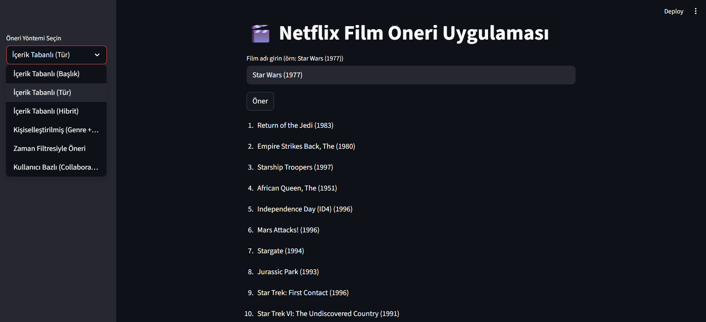

# 🎬 Netflix-Style Movie Recommender System

A personalized movie recommendation system built using the [MovieLens 100K dataset](https://www.kaggle.com/datasets/sudekacar/netflix-movie-recommender-system-movielens) and deployed with **Streamlit**.  
This project combines **content-based**, **collaborative filtering**, and **hybrid** techniques to suggest relevant movies to users based on their preferences and behavior.



## 🚀 Features

- 🎯 **Title-based Content Filtering**  
  Recommend similar movies based on their titles using TF-IDF Vectorization.

- 🎬 **Genre Preference Analysis**  
  Identify and recommend movies based on user's genre affinity (e.g., likes drama or sci-fi).

- 🧑‍🤝‍🧑 **Collaborative Filtering**  
  Recommend movies by finding similar users using matrix factorization techniques.

- 🧪 **Hybrid Recommender**  
  Combine user preferences + content similarity for more accurate suggestions.

- 📅 **Time Filtered Recommendations**  
  Choose to get recommendations from recent years or classics (e.g., only after 2010).

- 📊 **Personalized Scoring**  
  Ratings + genre scores are used together to calculate your perfect match list.

---

## 🧠 Tech Stack

- **Python** 🐍
- **Pandas**, **Scikit-learn**, **NumPy**
- **Streamlit** for interactive UI
- **MovieLens 100K** dataset

---

## 📷 Screenshot


---

## 📼 Demo Video

> [🎥 Watch on YouTube](https://youtu.be/BygwA0musBM)

---

## 🔗 Dataset

> 📂 [View on Kaggle](https://www.kaggle.com/datasets/seoksoon17/netflix-style-movie-recommender-dataset-100k)

---

## 💡 How to Run Locally

```bash
# Clone the repository
git clone https://github.com/sudekacar/netflix-recommender.git
cd netflix-recommender

# Create virtual environment
python -m venv venv
source venv/bin/activate    # or venv\Scripts\activate on Windows

# Install dependencies
pip install -r requirements.txt

# Run the app
streamlit run app.py
